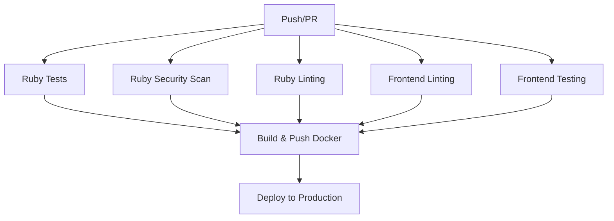

# CI/CD Workflow Updates

This document summarizes the changes made to integrate frontend linting and testing into the CI/CD pipeline.

## Changes Made

### 1. Updated `.github/workflows/ci.yml`

**New Jobs Added:**
- **`lint_frontend`**: Runs frontend code quality checks
- **`test_frontend`**: Runs frontend tests with coverage reporting

**Job Dependencies Updated:**
- `build_and_push` now requires all frontend jobs to pass
- Renamed `lint` to `lint_ruby` for clarity

### 2. Frontend Linting Job (`lint_frontend`)

**Steps:**
1. Checkout code
2. Setup Node.js 18 with npm caching
3. Install dependencies with `npm ci`
4. Run TypeScript compilation check (`npm run check`)
5. Run ESLint linting (`npm run lint`)
6. Check code formatting with Prettier (`npm run format:check`)

### 3. Frontend Testing Job (`test_frontend`)

**Steps:**
1. Checkout code
2. Setup Node.js 18 with npm caching
3. Install dependencies with `npm ci`
4. Run tests with coverage (`npm run test:coverage`)
5. Upload coverage to Codecov

### 4. Configuration Updates

**Vitest Config (`vitest.config.ts`):**
- Added `lcov` reporter for Codecov integration
- Coverage reports now generate in multiple formats

**Gitignore (`.gitignore`):**
- Added `/coverage` directory to ignore test coverage files

**Documentation (`FRONTEND.md`):**
- Updated with comprehensive CI/CD information
- Added coverage reporting details

## CI/CD Flow



## What Happens on Every Push

### Parallel Execution
The following jobs run in parallel:
- Ruby tests with PostgreSQL database
- Ruby security scanning with Brakeman
- Ruby linting with RuboCop
- **Frontend linting** (TypeScript, ESLint, Prettier)
- **Frontend testing** (Vitest with coverage)

### Quality Gates
All jobs must pass before:
- Building the Docker image
- Deploying to production
- Allowing PR merges

### Coverage Tracking
- Frontend test coverage is uploaded to Codecov
- Coverage reports are available in multiple formats
- Coverage badges can be added to README

## Benefits

1. **Quality Assurance**: Code quality is enforced on every push
2. **Consistency**: Formatting and linting standards are automatically checked
3. **Test Coverage**: Frontend test coverage is tracked and reported
4. **Fast Feedback**: Developers get immediate feedback on code quality
5. **Automated**: No manual intervention required for quality checks

## Scripts Available for Local Development

```bash
# Run the same checks locally
npm run check        # TypeScript compilation
npm run lint         # ESLint checks
npm run format:check # Prettier formatting check
npm run test:coverage # Run tests with coverage

# Auto-fix issues
npm run lint:fix     # Fix ESLint issues
npm run format       # Format code with Prettier
```

## Next Steps

1. **Setup Codecov**: Configure Codecov integration for coverage reports
2. **Branch Protection**: Enable branch protection rules requiring CI checks
3. **Status Badges**: Add CI and coverage badges to README.md
4. **Notifications**: Configure CI failure notifications if needed
